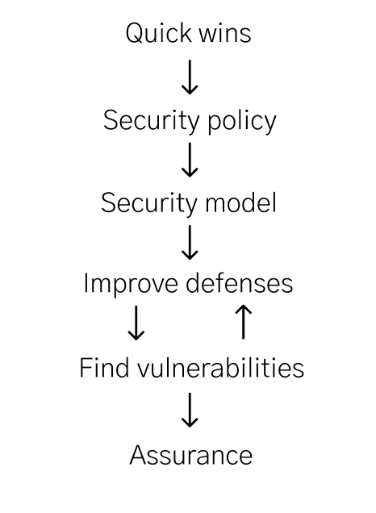
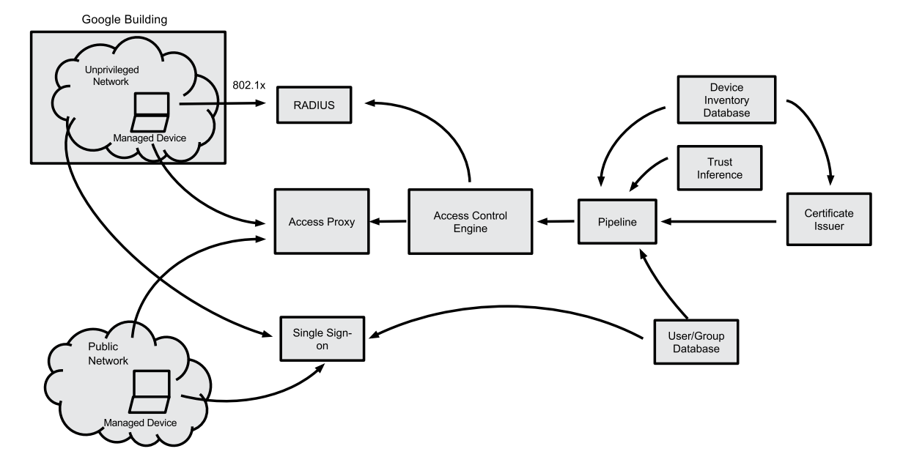

# How to Secure Anything

Security engineering is the discipline of building secure systems.

Its lessons are not just applicable to computer security. In fact, in this repo, I aim to document a process for securing anything, whether it's a medieval castle, an art museum, or a computer network.

> Please contribute! Create a pull request or just [create a issue](https://github.com/veeral-patel/how-to-secure-anything/issues/new) for content you'd like to add: I'll add it for you!

## Table of contents

- [What is security engineering?](#what-is-security-engineering)
- [High level process](#high-level-process)
- [Follow known best practices](#follow-known-best-practices)
- [Understand your adversaries](#understand-your-adversaries)
- [Security policies](#security-policies)
- [Security models](#security-models)
- [Improve defenses](#improve-defenses)
  - [Minimize attack surface](#minimize-attack-surface)
  - [Minimize and verify your trusted computing base (TCB)](#minimize-and-verify-your-trusted-computing-base-tcb)
  - [Separate privileges](#separate-privileges)
  - [Minimize privileges](#minimize-privileges)
  - [Secure by default](#secure-by-default)
  - [Secure by design](#secure-by-design)
  
  - [Prevent/detect/respond framework](#prevent-detect-respond-framework)
  - [Kill chains](#kill-chains)
  - [Security design principles](#security-design-principles)
- [Find vulnerabilities](#find-vulnerabilities)
  - [Developing an attacker mindset](#developing-an-attacker-mindset)
    - [Think in graphs](#think-in-graphs)
  - [Attack trees](#attack-trees)
  - [On, un-bypassable, tamperproof, functionally correct, fail closed](#on--un-bypassable--tamperproof--functionally-correct--fail-closed)
    - [Example: a burglar](#example--a-burglar)
  - [Assumptions analysis](#assumptions-analysis)
  - [Failure analysis](#failure-analysis)
    - [Fault tree analysis](#fault-tree-analysis)
    - [FMEA](#fmea)
  - [Protocol analysis](#protocol-analysis)
  - [Side channel analysis](#side-channel-analysis)
- [Assurance](#assurance)
- [Popular mechanisms](#popular-mechanisms)
  - [Cryptography](#cryptography)
  - [Economics](#economics)
  - [Laws and regulations (deterrence by the government)](#laws-and-regulations-deterrence-by-the-government)
  - [Retaliation (deterrence by you or third parties)](#retaliation-deterrence-by-you-or-third-parties)
  - [Tamper resistance](#tamper-resistance)
  - [Tamper detection](#tamper-detection)
  - [Access control](#access-control)
  - [Authentication](#authentication)
    - [Biometrics](#biometrics)
  - [Authorization](#authorization)
    - [Multilevel](#multilevel)
    - [Multilateral](#multilateral)
    - [Two-man rule](#two-man-rule)
  - [Inference control](#inference-control)
  - [Sandboxing](#sandboxing)
  - [Logging & auditing](#logging---auditing)
  - [Air-gapping](#air-gapping)
    - [Attacking](#attacking)
  - [Obscurity](#obscurity)
- [Learn about how real world systems are secured](#learn-about-how-real-world-systems-are-secured)
  - [Physical facilities](#physical-facilities)
    - [Defending](#defending)
    - [Attacking](#attacking-1)
  - [Nuclear command and control](#nuclear-command-and-control)
  - [Monitoring and metering](#monitoring-and-metering)
  - [Banking and bookkeeping](#banking-and-bookkeeping)
    - [Defending](#defending-1)
    - [Attacking](#attacking-2)
  - [Distributed systems](#distributed-systems)
  - [Copyright and DRM](#copyright-and-drm)
  - [Web browsers](#web-browsers)
  - [Web applications](#web-applications)
  - [Android](#android)
  - [BeyondCorp & zero trust](#beyondcorp---zero-trust)
    - [Architecture](#architecture)
    - [Summary](#summary)
    - [Authentication](#authentication-1)
    - [Key components](#key-components)
    - [End to end flow](#end-to-end-flow)
    - [Prereqs for compromising a service](#prereqs-for-compromising-a-service)
    - [Before/after](#before-after)
    - [Further reading](#further-reading)
  - [Apple](#apple)
  - [Cloud providers](#cloud-providers)
  - [Computer networks](#computer-networks)
  - [Operating systems](#operating-systems)
    - [Time protection](#time-protection)
  - [sel4](#sel4)
  - [SELinux](#selinux)
  - [AppArmor](#apparmor)
  - [Chromebook](#chromebook)
  - [Prisons](#prisons)
  - [Voting](#voting)
  - [Museums](#museums)
    - [Defending](#defending-2)
    - [Attacking](#attacking-3)
  - [Counterintelligence](#counterintelligence)
  - [Casinos](#casinos)
    - [Defending](#defending-3)
    - [Attacking](#attacking-4)
  - [Military Architecture](#military-architecture)
    - [Defending](#defending-4)
    - [Attacking](#attacking-5)
    - [Both](#both)
- [Books](#books)
  - [Recommended](#recommended)
  - [More](#more)
  - [Haven't read yet](#haven-t-read-yet)
- [Papers](#papers)
- [Content wanted](#content-wanted)
- [In the future](#in-the-future)

## What is security engineering?

Security engineering isn't about adding a bunch of controls to something.

It's about coming up with security properties you'd like a system to have, choosing
mechanisms that enforce these properties, and assuring yourself that your security properties hold.

- ["What is security engineering?" (from Anderson's book)](https://www.cl.cam.ac.uk/~rja14/Papers/SEv3-ch1-dec18.pdf) - [my notes](anderson/anderson-ch1.md)
- [What's the problem? (from Saydjari's book)](https://www.oreilly.com/library/view/engineering-trustworthy-systems/9781260118186/ch1.xhtml) - [my notes](saydjari/saydjari-ch1.md)
- [Computer security in the real world](what_is_it/computer_security_in_the_real_world.pdf)
- [Human Adversaries – Why Information Security Is Unlike Engineering](https://www.scriptjunkie.us/2016/01/human-adversaries-why-information-security-is-unlike-engineering/)
- Natural Advantages of Defense: What Military History Can Teach Network Security - [Part 1](https://www.schneier.com/crypto-gram/archives/2001/0415.html#1), [Part 2](https://www.schneier.com/crypto-gram/archives/2001/0515.html#1)
- [Availability and Security: Choose One](https://www.cs.auckland.ac.nz/~pgut001/pubs/availability.pdf)

## High level process

Here's the process I like for securing things:

- We follow as many known best practices as we can. If humans already know how to secure something well, why try to derive the answer ourselves?
- Learn about the adversaries you want to defend against
- We write down our security policies, or high level security goals
- We develop a security model, or a spec we follow to satisfy our policies
- We reduce attack surface, follow security design principles, brainstorm ideas for and implement additonal security controls, and more -- to improve our security
- We test our design by assessing our controls, assessing protocols, looking for side channels, and more
- We write assurance cases to prove we satisfy our security policy.

## Follow known best practices

Before anything else, I'd Google for the best practices for securing whatever you're trying to secure and implement all of them.

If you're in a corporate environment, set up SSO and 2FA. If you're securing a physical facility, see if there's a well-regarded physical security standard you can comply with.

I'd study how people have defended what you're defending now in the past. Also, I'd talk to the people who are the very best at defending what I'm defending now, and learn what they do that most people don't do.

Doing this will make you significantly more secure than the majority of people, who don't do this.

## Understand your adversaries

There's no such thing as a system being secure, only being secure against a particular adversary.

This is why it's important to understand who your adversaries are, as well as the motivation behind
and capabilities of each adversary.

Consider non-human threats, too. If you're asked to secure a painting in a museum, a fire may technically not be a security issue -- but it's something to guard against, regardless.

Also, study the history of attacks. If I was designing a prison, I'd learn about all the past prison breakouts that I could.

- [Agile threat modeling](https://martinfowler.com/articles/agile-threat-modelling.html) - [my notes](threat_modeling/agile-threat-modeling.md)
- [Threat Modeling: Designing for Security](https://www.amazon.com/Threat-Modeling-Designing-Adam-Shostack/dp/1118809998)
- [Awesome Threat Modeling](https://github.com/hysnsec/awesome-threat-modelling)
- [Some thoughts on threat modeling](https://www.cs.auckland.ac.nz/~pgut001/pubs/threat_modelling.pdf)
- [Threat modeling: 12 available methods](https://insights.sei.cmu.edu/sei_blog/2018/12/threat-modeling-12-available-methods.html)
- [Approachable threat modeling](https://increment.com/security/approachable-threat-modeling/)
- [OWASP Threat Model Cookbook](https://github.com/OWASP/threat-model-cookbook)
- [Threat modeling for dummies](https://www.slideshare.net/AdamEnglander/threat-modeling-for-dummies-cascadia-php-2018)
- [Threat modeling cheatsheet (from OWASP)](https://cheatsheetseries.owasp.org/cheatsheets/Threat_Modeling_Cheat_Sheet.html)
- [A Guide to Understanding Security Modeling in Trusted Systems](https://fas.org/irp/nsa/rainbow/tg010.pdf)
- [Adversaries: Know Thy Opponent (from Saydjari's book)](https://learning.oreilly.com/library/view/engineering-trustworthy-systems/9781260118186/ch6.xhtml#ch6)
- ["Who is your opponent?" (from Anderson's book)](https://www.cl.cam.ac.uk/~rja14/Papers/SEv3-ch2-dec18.pdf)

## Security policies

Policies are the high level properties we want our system to have. Policies are what we want to happen.

Let's say we're designing a prison.

I'd start with a strong policy:

> No prisoner may escape the prison.

Of course, time, money, and manpower are all limited. The goal isn't to eliminate risk entirely,
but bring it down to an acceptable level.

As I go through the next couple steps and learn what controls I need and how costly they'll be, I might refine my security policy to something like this:

> No more than 10 out of 10,000 (0.1%) prisoners may escape our prison in any given time period.

[Looking at benchmarks](http://citeseerx.ist.psu.edu/viewdoc/download?doi=10.1.1.849.2782&rep=rep1&type=pdf) may help us come up with this number.

Any system has additional requirements in addition to its security requirements. These two sets of requirements may conflict, so you may need to relax your security requirements.

Going back to the example above, our policy is that only a tiny percentage of prisoners may leave the prison without permission. But what if there's a fire?

If you've achieved this low escape rate by building a fully autonomous fortress with no fire detection or human override, the results may be suboptimal.

## Security models

We can then turn our policy into a more detailed model. A model is a set of rules, a specification, we can follow to achieve our policy. Our policy is our "what", the model is our "how".

> Each individual in the prison facility must have a ID that identifies him/her as a "prisoner" or "not a prisoner"

> A prisoner may have the written consent of the warden to leave.

> A non-prisoner may leave at any time.

- [Computer Security: Art and Science](https://www.amazon.com/Computer-Security-Art-Science-Set/dp/013428951X) covers this topic very well
- [Flask security architecture](https://www.cs.cmu.edu/~dga/papers/flask-usenixsec99.pdf)
- [Sancus 2.0: A Low-Cost Security Architecture for IoT Devices](https://www.esat.kuleuven.be/cosic/publications/article-2785.pdf)

Luckily, in information security, our policies often revolve around confidentiality, integrity, and availability and so there are popular existing security models for each of these policies.

For confidentiality, for example, you can choose between:

- [multilevel security](#multilevel), for which [Bell-Padula](https://en.wikipedia.org/wiki/Bell%E2%80%93LaPadula_model) can be used
- [multilateral security](#multilateral), for which compartmentation, BMA, [Chinese wall](https://people.csail.mit.edu/alinush/6.858-fall-2014/papers/chinese-wall-sec-pol.pdf) can be used (according to Anderson's book)

See also [this Wikipedia article](https://en.wikipedia.org/wiki/Computer_security_model) and [this one](https://en.wikipedia.org/wiki/Category:Computer_security_models) on computer models.

## Improve defenses

Here are some useful techniques I've found for improving the security of a system.

Also see if you any of the mechanisms in [popular mechanisms](#popular-mechanisms) would help.

### Minimize attack surface

See tptacek's [HN comment on this](https://news.ycombinator.com/item?id=17014818):

> For instance: you can set up fail2ban, sure. But what's it doing for you? If you have password SSH authentication enabled anywhere, you're already playing to lose, and logging and reactive blocking isn't really going to help you. Don't scan your logs for this problem; scan your configurations and make sure the brute-force attack simply can't work.

> The same goes for most of the stuff shrink-wrap tools look for in web logs. OSSEC isn't bad, but the things you're going to light up on with OSSEC out of the box all mean something went so wrong that you got owned up.

> Same with URL regexes. You can set up log detection for people hitting your admin interfaces. But then you have to ask: why is your admin interface available on routable IPs to begin with?

- [OWASP Attack Surface Analysis Cheat Sheet](https://cheatsheetseries.owasp.org/cheatsheets/Attack_Surface_Analysis_Cheat_Sheet.html)
- See the papers in [this folder](attack_surface)

### Minimize and verify your trusted computing base (TCB)

When evaluating a design, it's useful to see how much of the system must be trusted in order for a security goal
to be achieved. The smaller this trusted computing base is, the better.

Also, once you identify the TCB for an existing system, you know that you only need to secure your TCB. You don't
need to worry about securing components outside your TCB.

You want to make your TCB as small, simple, unbypassable, tamper-resistant, and verifiable as you can, as I
write about [here](https://github.com/veeral-patel/learn-security-engineering/blob/master/ucb-tcb-notes.md#remember).

- [OS Security Concepts (from CS 161 from UC Berkeley)](https://inst.eecs.berkeley.edu/~cs161/fa16/slides/lec4.pdf)
- [Design patterns for building secure systems](https://inst.eecs.berkeley.edu/~cs161/fa16/notes/1.27.patterns.pdf) - [my notes](ucb-tcb-notes.md)
- [TSAFE: Building a Trusted Computing Base forAir Traffic Control Software](tcbs/tsafe.pdf)
- [Ten page intro to trusted computing](tcbs/ten_page_intro_to_trusted_computing.pdf)
- [Reducing TCB Complexity for Security-Sensitive Applications: Three Case Studies](http://141.76.48.99/papers_ps/eurosys2006.pdf)
- [The Nizza Secure-System Architecture](https://genode-labs.com/publications/nizza-2005.pdf)

### Separate privileges

When designing a system, a great way to mitigate the impact of a successful attack is to break the system
down into components based upon their privilege level.

Then, ask what's the least amount of privilege each component needs -- and then enforce the allowed privileges with a [sandbox](https://github.com/veeral-patel/learn-security-engineering#sandboxing) (if applicable).

Say one of our SRE SSH's into a production EC2 instance as `root` to check the instance's memory and CPU usage. Instead, we can assign the SRE a non-root account. Even better, we can whitelist the commands this account can run.
Even better, we can even remove SSH access entirely and set up [Prometheus](https://prometheus.io/) for monitoring.

- [Lecture 4: Privilege Separation (6.858 from MIT)](https://ocw.mit.edu/courses/electrical-engineering-and-computer-science/6-858-computer-systems-security-fall-2014/video-lectures/lecture-4-privilege-separation/) - [my notes](mit-6858-lec-4-privilege-separation.md)
- [SSH daemon (from Niels Provos)](http://www.citi.umich.edu/u/provos/ssh/privsep.html)
- [OKWS paper](https://pdos.csail.mit.edu/papers/okws-usenix04.pdf)
- [Security architecture of the Chromium browser](http://seclab.stanford.edu/websec/chromium/chromium-security-architecture.pdf)
- [Nested Kernel: An Operating System Architecture for Intra-Kernel Privilege Separation](https://nathandautenhahn.com/downloads/publications/asplos200-dautenhahn.pdf)
- [Privilege bracketing](https://en.wikipedia.org/wiki/Privilege_bracketing) - see also [this page](https://docs.oracle.com/cd/E19109-01/tsolaris8/816-1042/6m7g4ma52/index.html)
- [Exploit mitigation techniques in OpenBSD](http://www.openbsd.org/papers/v)
- [Privtrans: Automatically Partitioning Programs for Privilege Separation](https://www.usenix.org/legacy/event/sec04/tech/full_papers/brumley/brumley_html/)

### Minimize privileges

- [Ways to minimize privileges](https://dwheeler.com/secure-programs/Secure-Programs-HOWTO/minimize-privileges.html)
- [Make least privilege a right (not a privilege)](https://www.scs.stanford.edu/~dm/home/papers/krohn:least-privilege.pdf)
- [Plash: tools for least privilege](http://www.plash.beasts.org/index.html)
- [SHILL: A Secure Shell Scripting Language](https://www.usenix.org/system/files/conference/osdi14/osdi14-paper-moore.pdf)
- [Security wrappers and Bernstein chaining](http://www.catb.org/~esr/writings/taoup/html/ch06s06.html)

### Secure by default

- [Weakest link security](https://www.schneier.com/blog/archives/2005/12/weakest_link_se.html) - ignore the title!
- [Secure by default – the case of TLS](https://arxiv.org/pdf/1708.07569.pdf)
- [Configure Safely and Use Safe Defaults](https://dwheeler.com/secure-programs/Secure-Programs-HOWTO/safe-configure.html)

### Secure by design

- [Stop trying to fix the user](https://www.schneier.com/blog/archives/2016/10/security_design.html)

### Prevent/detect/respond framework

The way I see it, every defense falls into one of these categories:

- Prevent: consists of deter, stop
- Detect
- Respond: consists of delay, contain, investigate, remediate

Take any attack. Then, for each of the seven categories, brainstorm defenses that fall into that category.

### Kill chains

By mapping out an adversary's kill chain, we can then identify controls to counteract
each step in the kill chain. Check out [MITRE ATT&CK](https://attack.mitre.org/).

- [Kill chains (Wikipedia)](https://en.wikipedia.org/wiki/Kill_chain)

### Security design principles

I would go down this list and see if there's any principles which you can apply to your system.

- Secure the weakest link
- Defense in depth
- Fail securely
- Secure by default - discussed earlier in the repo
- Least privilege - discussed earlier in the repo
- Separation of privilege - discussed earlier in the repo
- Economy of mechanism - controls should be as simple as possible
- Least common mechanism - limit unnecessary sharing. see [this](https://dwheeler.com/secure-programs/Secure-Programs-HOWTO/minimize-data-access.html)
- Open design - your design should be secure without obscurity. obscurity is discussed [later in the repo](#obscurity)
- Complete mediation - applies to reference monitors, which many controls are. The idea is to perform a check on every request. If you cache results, then a request that should be rejected after things changed might be allowed. [See this link](https://us-cert.cisa.gov/bsi/articles/knowledge/principles/complete-mediation)
- Work factor - find ways to make the attacker need to do several times more work to break something than it takes you, the defender. [Here's a paper](https://www.nspw.org/papers/2000/nspw2000-schudel.pdf) on dynamic network reconfiguration being used to increase recon work for attackers
- Security is economics - discussed [later in the repo](#economics)
- Human factors matter - if a control relies on a human to do something, make sure your control is usable or the person just won't do it
- Know your threat model & update it - keep your threat model up to date with threats, and your defenses too
- Trust only trustworthy channels - see [this article](https://dwheeler.com/secure-programs/Secure-Programs-HOWTO/trustworthy-channels.html)
- Set up a trusted path - see [this article](https://dwheeler.com/secure-programs/Secure-Programs-HOWTO/trusted-path.html)
- Set up a central chokepoint for access control and logging (see also reference monitor)

Sources

- [Stop buying bad security prescriptions](https://medium.com/@justin.schuh/stop-buying-bad-security-prescriptions-f18e4f61ba9e)
- [Design principles (from US CERT)](https://www.us-cert.gov/bsi/articles/knowledge/principles/design-principles)
- [Principles for building secure systems](https://inst.eecs.berkeley.edu/~cs161/sp19/notes/Principles.1.19.pdf)
- [More principles](https://tramnguyenio.files.wordpress.com/2017/03/design-principles.pdf)
- [Even more principles (from David Wagner)](https://people.eecs.berkeley.edu/~daw/teaching/cs261-f07/slides-aug30.pdf)
- [The Information Security Practice Principles](https://cacr.iu.edu/principles/ISPP-Foundational-Whitepaper-2017.pdf)

## Find vulnerabilities

The techniques below help you find vulnerabilities in a proposed design for you to fix.

### Developing an attacker mindset

> Theories of security derive from theories of insecurity. - Unknown

> If you're a great attacker you can be "logically" a great defender. However, a great defender cannot be a great attacker, nor would I say they could be a "great" defender. - [Caleb Sima](https://twitter.com/csima), VP of Security at Databricks

> Any person can invent a security system so clever that she or he can't think of how to break it - [Schneier's Law](https://www.schneier.com/blog/archives/2011/04/schneiers_law.html)

More important than the attacks in subsequent sections is being able to think creatively, like an attacker. I do believe this skill is essential if you want in order to assess the security of your designs effectively.

This section describes some techniques for developing this skill that I've gathered.

#### Think in graphs

Read [this post by John Lambert first](https://github.com/JohnLaTwC/Shared/blob/master/Defenders%20think%20in%20lists.%20Attackers%20think%20in%20graphs.%20As%20long%20as%20this%20is%20true%2C%20attackers%20win.md). It's about how attackers think in graphs, while defenders think in lists, so attackers win.

I've copied the list of links below from John's post above.

- [Heat-ray: Combating Identity Snowball Attacks Using Machine Learning, Combinatorial Optimization and Attack Graph](http://alicezheng.org/papers/sosp2009-heatray-10pt.pdf)
- [Two Formal Analyses of Attack Graphs](http://www.cs.cmu.edu/~scenariograph/jha-wing.pdf)
- [Using Model Checking to Analyze Network Vulnerabilities](http://cyberunited.com/wp-content/uploads/2013/03/Using-Model-Checking-to-Analyze-Network-Vulnerabilities.pdf)
- [A Graph-Based System for Network-Vulnerability Analysis](http://web2.utc.edu/~djy471/CPSC4660/graph-vulnerability.pdf)
- [Automated Generation and Analysis of Attack Graphs](https://www.cs.cmu.edu/~scenariograph/sheyner-wing02.pdf)
- [Modern Intrusion Practices](https://www.blackhat.com/presentations/bh-usa-03/bh-us-03-richarte.pdf)
- [Attack Planning in the Real World](http://arxiv.org/pdf/1306.4044.pdf)

### Attack trees

After building an attack tree, you can query it easily: "list all the attack paths costing
less than \$100k". (Remember: we don't seek absolute security, but rather security against
a certain set of adversaries.)

Also, remember the [weakest link principle](https://www.us-cert.gov/bsi/articles/knowledge/principles/securing-the-weakest-link). You can query your attack tree for the lowest cost attack
path and ensure that the cost isn't too low.

- [Attack trees (from Bruce Schneier)](https://www.schneier.com/academic/archives/1999/12/attack_trees.html)

### On, un-bypassable, tamperproof, functionally correct, fail closed

If a security control does not have the qualities above, then an attacker can violate a system's security properties by subverting its controls.

- Can the attacker turn off the control?
- Can the attacker get you to turn off the control?
- Can the attacker get around your control?
- Does the control depend on something that the attacker can disable?
- Are there any cases where the control doesn't work?
- Does the control fail open or closed? If it fails open, can the attacker make the control fail?

#### Example: a burglar

Take a burglar confronting a home security system which calls the police if someone crosses the lawn at night

- Can the burglar turn off the control? Probably not
- Can the burglar get you to turn off the control? Yes, they could set off the alarm everyday until you turn it off
- Can the burglar get around your control? Yes, they could land on the roof
- Does the control depend on something that the burglar can disable? Yes, the burglar can cut the electric wire or the fiber cable used to call the police
- Are there any cases where the control doesn't work? The burglar can buy the control and learn the alarm doesn't go off if they tip toes.

### Assumptions analysis

I like using a statement/conclusion format to draw out my assumptions about my controls.

Statement: I have a home security system which calls the police if someone crosses the lawn.

Conclusion: I won't get robbed.

Assumptions:

- For every single attacker that tries to cross my lawn, my home security system calls the police. (If the answer to any of the questions above is yes, this assumption is false.)
- The police will arrive before any attacker is able to steal anything and stop the theft.
  - What if the attacker impersonates the homeowner and tells the police that my home security system is faulty; don't come if it calls you?
  - What if the attacker makes hundreds of 911 calls while they are robbing the house?
  - What if the police is blocked by a "car accident"? What if the attacker has arranged for a getaway helicopter?

Saydjari writes an entire chapter on this:

- [Architecting cybersecurity (from Saydjari's book)](https://learning.oreilly.com/library/view/engineering-trustworthy-systems/9781260118186/ch20.xhtml) - [my notes](saydjari/saydjari-ch20.md)

### Failure analysis

We want our security controls to fail closed, not open. There's two ways to analyze the ways something
might fail: failure tree analysis (FTA), which is top down, and failure modes and effects analysis (FMEA),
which is bottom up.

- [How to avoid failures](https://www.dsiintl.com/wp-content/uploads/2017/04/HOW-TO-AVOID-FAILURES-FMEA-andor-FTA.pdf)
- [Hazard Analysis Techniques for System Safety](https://www.amazon.com/Hazard-Analysis-Techniques-System-Safety/dp/0471720194)
- [Intro to Systems Theoretic Process Analysis (STPA)](http://psas.scripts.mit.edu/home/wp-content/uploads/2016/01/Systems-Theoretic-Process-Analysis-STPA-John-Thomas.pdf)

#### Fault tree analysis

- [Intro to fault trees](https://www.weibull.com/basics/fault-tree/index.htm)

#### FMEA

- [FMEA Procedure](https://asq.org/quality-resources/fmea)
- [FMEA: From Theory to Execution](https://www.amazon.com/Failure-Mode-Effect-Analysis-Execution/dp/0873895983)
- [The Basics of FMEA](https://www.amazon.com/Basics-FMEA-Raymond-J-Mikulak/dp/1563273772)

### Protocol analysis

Protocols aren't a tool for securing something. But all communication between two components of a system is done through
a protocol, so it's worth learning how to analyze protocols for vulnerabilities.

- ["Protocols" (from Anderson's book)](https://www.cl.cam.ac.uk/~rja14/Papers/SEv3-ch4-dec18.pdf)
- [A logic of authentication](protocols/a_logic_of_authentication.pdf)
- [Programming Satan's computer](protocols/programming_satans_computer.pdf)
- [Using Encryption for Authentication in Large Networks of Computers](protocols/using_encryption_for_authentication_in_large_networks_of_computers.pdf)
- [Three systems for cryptographic protocol analysis](protocols/three_systems_for_cryptographic_protocol_analysis.pdf)

### Side channel analysis

Even if something isn't vulnerable to attacks (on confidentiality, integrity, or
availability), it may leak information which makes these attacks easier.

For example, take a login program that checks if the username is valid, returns
a generic "login failed" error if it's not, then checks if the password is valid,
and returns the same generic error if it's not.

At a first glance, determining if a particular username is valid may seem
impossible. After all, the error message is the same regardless of whether the
username is invalid or the username is valid and the password is invalid.

However, an attacker could examine the time it takes to get the error to
determine if the username is valid or not.

- ["Side channels" (from Anderson's book)](https://www.cl.cam.ac.uk/~rja14/Papers/SEv3-ch19-dec18.pdf)
- [Covert vs overt vs side channels](https://security.stackexchange.com/questions/113332/covert-overt-and-side-channels) - See this [Stack Overflow answer](https://stackoverflow.com/questions/4083860/in-computer-security-what-are-covert-and-side-channels) too
- [A Guide to Understanding Covert Channel Analysis of Trusted Systems](https://fas.org/irp/nsa/rainbow/tg030.htm#2.0)
- [List of ways to find side channels in hardware/software](https://pastebin.com/ajqxDJ3J)

## Assurance

The goal of security engineering is to build a system that satisfies certain security properties -- not just to add a lot of controls.
Assurance is how we prove that our system satisfies the properties we want it to.

- [Assuring cybersecurity: getting it right (from Saydjari's book)](https://learning.oreilly.com/library/view/engineering-trustworthy-systems/9781260118186/ch21.xhtml#ch21)
- [Notes on high-assurance security methods by nickpsecurity](https://gist.github.com/ryazo/3267bcd5aedeebb9224ad90183a5eb85) - see also his writeup on [software distribution](https://pastebin.com/EZQWbwCB)
- [Guidelines for Formal Verification Systems](https://fas.org/irp/nsa/rainbow/tg014.htm)
- [Constructing a high assurance mail guard](https://cryptosmith.files.wordpress.com/2014/10/mailguard.pdf)
- [Designing The Gemsos Security Kernel For Security And Performance](http://mrheckman.com/yahoo_site_admin/assets/docs/DesigningTheGemsosSecurityKernel-OCR-120409-DRAFT.158131458.pdf)
- [SIFT: Design and Analysis of a Fault-Tolerant Computer for Aircraft Control](https://www.microsoft.com/en-us/research/wp-content/uploads/2016/12/Design-and-Analysis-of-a-Fault-Tolerant-Computer-for-Aircraft-Control.pdf)
- [Design and Verification of Secure Systems](http://www.csl.sri.com/users/rushby/papers/sosp81.pdf)
- [Commercial Product Evaluations](http://webapp1.dlib.indiana.edu/virtual_disk_library/index.cgi/1347159/FID1930/INDEX.HTML)
- [Make computers keep secrets](https://dspace.mit.edu/bitstream/handle/1721.1/33481/24370594-MIT.pdf)
- [Hints for High-Assurance Cyber-Physical System Design](https://leepike.github.io/pubs/pike-secdev16.pdf)
- [High-Assurance Separation Kernels: A Survey on Formal Methods](https://arxiv.org/pdf/1701.01535.pdf)
- [Separation Virtual Machine Monitors](http://citeseerx.ist.psu.edu/viewdoc/download?doi=10.1.1.363.3314&rep=rep1&type=pdf#page=435)
- [The Cross Domain Desktop Compositor: Using hardware-based video compositing for a multi-level secure user interface](https://people.eng.unimelb.edu.au/tobym/papers/cddc-acsac2016.pdf)
- [CH26 Managing the Development of Secure Systems (from Anderson's book)](https://www.cl.cam.ac.uk/~rja14/Papers/SEv3-ch26-jul24.pdf)
- [CH27 Assurance & Sustainability (from Anderson's book)](https://www.cl.cam.ac.uk/~rja14/Papers/SEv3-ch27-jul24.pdf)
- [We need assurance!](https://www.acsac.org/2005/papers/Snow.pdf)
- [The Orange Book](https://csrc.nist.gov/csrc/media/publications/conference-paper/1998/10/08/proceedings-of-the-21st-nissc-1998/documents/early-cs-papers/dod85.pdf)
- [Public Pentesting Reports](https://github.com/juliocesarfort/public-pentesting-reports)
- [High-Assurance Smart Card Operating System for Electronic Visas](https://researcher.watson.ibm.com/researcher/files/us-msteiner/secure-token.IBM%20ICAO%20RFI%20os%2005182005pak%20.pdf)
- [A Touch of Evil: High-Assurance Cryptographic Hardware from Untrusted Components](https://acmccs.github.io/papers/p1583-mavroudisA.pdf)
- [Lessons learned from building a high assurance crypto gateway](https://apps.dtic.mil/dtic/tr/fulltext/u2/a570736.pdf)
- [Formal Specification and Verification of a Microkernel](http://people.cs.ksu.edu/~danielwang/Investigation/Formal_Verification/JD10.pdf)
- [Final evaluation report of SCOMP](https://apps.dtic.mil/dtic/tr/fulltext/u2/a229523.pdf)
- See the papers in [this folder](assurance)

## Popular mechanisms

In order to secure something, you need to know what tools are available to you. Here are some that which can be used in many different contexts.

A lot of tools are context-specific, however. Before I start trying to secure a building, for example, I'd spend the time to learn about all the tools I can use: walls, sensors, natural barriers, guards, CCTV cameras, etc

### Cryptography

- [Cryptography: A Sharp and Fragile Tool (from Saydjari's book)](https://learning.oreilly.com/library/view/engineering-trustworthy-systems/9781260118186/ch10.xhtml#ch10)
- [Applied Cryptography: Protocols, Algorithms and Source Code in C](https://www.amazon.com/Applied-Cryptography-Protocols-Algorithms-Source-dp-1119096723/dp/1119096723)
- ["Cryptography Engineering" book](https://www.amazon.com/Cryptography-Engineering-Principles-Practical-Applications-ebook/dp/B004NSW9JU/ref=sr_1_1?crid=WBP1JC682B4V&dchild=1&keywords=cryptography+engineering&qid=1586149852&s=books&sprefix=cryptography+eng%2Cstripbooks%2C-1&sr=1-1)
- ["Cryptography" (from Ross Anderson's book)](https://www.cl.cam.ac.uk/~rja14/Papers/SEv3-ch5-dec18.pdf)
- ["Advanced Cryptographic Engineering" (from Ross Anderson's book)](https://www.cl.cam.ac.uk/~rja14/Papers/SEv3-ch20-mar17.pdf)
- [Don't trust the math (Bruce Schneier)](https://pastebin.com/zz7YZZUk)

### Economics

The idea here is to make it economically, not technically, infeasible for the attacker to attack us. He can still attack us, but his expected effort will exceed his expected gain.

Say a scammer manages to scam one of every hundred people out of $5. If we can add a $0.10 fee to every call, then they'd need to pay $10 in fees to earn $5.

Another example would be not storing credit card data ourselves, and instead outsourcing this to a payment processor, so the reward of attacking us is less.

If the attacker isn't motivated by money, this doesn't work.

- ["Economics" (from Anderson's book)](https://www.cl.cam.ac.uk/~rja14/Papers/SEv3-ch8-dec18.pdf)
- [Security Economics](https://ocw.mit.edu/courses/electrical-engineering-and-computer-science/6-858-computer-systems-security-fall-2014/video-lectures/lecture-23-security-economics/) - here's the [transcript](https://ocw.mit.edu/courses/electrical-engineering-and-computer-science/6-858-computer-systems-security-fall-2014/video-lectures/lecture-23-security-economics/8PdnOZI7H5E.pdf)

### Laws and regulations (deterrence by the government)

Deterrence has three parts: certainty, severity, and swiftness. In other words, to deter attackers most effectively, someone should be able to catch most
or all of them -- and do this quickly -- and then sufficiently punish them once you do catch them.

This someone could be the government, via laws and regulations against whatever you're trying to defend against. The government may not catch everyone,
but these laws and regulations will deter most people. Copyright protection, anti-shoplifting, and anti-trespassing laws all are examples of this.

### Retaliation (deterrence by you or third parties)

The government is not the only third party who can deter attacks on you. Organizations, like NATO, can as well.

Alternatively, you can try to retaliate against attacks yourself. Take, for example, media companies that sue people that pirate their movies.

- [Deterrence and adversarial risk (from Saydjari's book)](https://learning.oreilly.com/library/view/Engineering+Trustworthy+Systems:+Get+Cybersecurity+Design+Right+the+First+Time/9781260118186/ch16.xhtml#ch16lev1) - [my notes](saydjari/saydjari-ch16.md)

### Tamper resistance

- ["Physical tamper resistance" (from Anderson's book)](https://www.cl.cam.ac.uk/~rja14/Papers/SEv3-ch18-dec18.pdf)
- [Cryptographic processors – a survey](https://www.cl.cam.ac.uk/techreports/UCAM-CL-TR-641.pdf)
- [Smartcard Handbook](https://www.amazon.com/Smart-Card-Handbook-Wolfgang-Rankl/dp/0470743670)
- [Tamper Resistance - a Cautionary Note](https://www.cl.cam.ac.uk/~rja14/tamper.html)
- [Low Cost Attacks on Tamper Resistant Devices](http://web.cse.msstate.edu/~ramkumar/tamper2.pdf)
- [Design Principles for Tamper-Resistant Smartcard Processors](https://www.cl.cam.ac.uk/~mgk25/sc99-tamper.pdf)

### Tamper detection

If we can't prevent tampering, we can try to make it obvious when something has been tampered with.

This is one reason why bags of chips or gallons of milk, for example, are sealed.

- [Optical Document Security](https://www.amazon.com/Optical-Document-Security-Rudolf-Renesse/dp/1580532586/)
- ["Security printing and seals" (from Anderson's book)](https://www.cl.cam.ac.uk/~rja14/Papers/SEv3-ch16-dec18.pdf)

### Access control

- ["Access Control" (from Anderson's book)](https://www.cl.cam.ac.uk/~rja14/Papers/SEv2-c04.pdf)
- [OS Security Concepts (from CS 161 from UC Berkeley)](https://inst.eecs.berkeley.edu/~cs161/fa16/slides/lec4.pdf)
- [Understanding Discretionary Access Control In Trusted Systems](https://fas.org/irp/nsa/rainbow/tg003.htm)
- [Awesome Object Capabilities and Capability-based Security](https://github.com/dckc/awesome-ocap)
- [What are capabilities?](http://habitatchronicles.com/2017/05/what-are-capabilities/)
- [Capability Security Model](https://wiki.c2.com/?CapabilitySecurityModel)

### Authentication

The three ways to authenticate someone are:

- what you know (eg, PIN, password, picture passwords)
- what you have (eg, Yubikey, smartphone, smartcard, token hardware)
- what you are (eg, a fingerprint)

While not a standalone factor, you can consider the environment, too, such as where the user is or what time it is.

- [DOD Password Management Guideline](https://fas.org/irp/nsa/rainbow/std002.htm)
- [A Guide to Understanding Identification and Authentication in Trusted Systems](https://fas.org/irp/nsa/rainbow/tg017.htm)
- [Authentication (from Saydjari's book)](https://learning.oreilly.com/library/view/engineering-trustworthy-systems/9781260118186/ch11.xhtml#ch11)

#### Biometrics

- ["Biometrics" (from Anderson's book)](https://www.cl.cam.ac.uk/~rja14/Papers/SEv3-ch17-dec20.pdf)

### Authorization

Without authorization, anyone who authenticates to our system would have full access to everything. We'd like to make it more difficult than that for attackers, and likely don't trust all insiders that much, either.

- [Authorization (from Saydjari's book)](https://learning.oreilly.com/library/view/engineering-trustworthy-systems/9781260118186/ch12.xhtml#ch12)
- [Domain type enforcement](https://www.cs.cornell.edu/courses/cs5430/2012sp/dte.html)
- [Type enforcement chapter (from SELinux book)](https://learning.oreilly.com/library/view/selinux/0596007167/ch07.html)
- [Domain and type enforcement for Linux](https://www.usenix.org/legacy/publications/library/proceedings/als00/2000papers/papers/full_papers/hallyn/hallyn_html/index.html)

#### Multilevel

Think about the intel classification hierarchy: some documents are top secret, others are secret, others are confidential, and so on. This is a multi-level scheme.

- ["Multilevel Security" (from Anderson's book)](https://www.cl.cam.ac.uk/~rja14/Papers/SEv2-c08.pdf)
- [An analysis of the systemic security weaknesses of the U.S. Navy fleet broadcasting system, 1967-1974, as exploited by CWO John Walker](multilevel/walker_spy_ring.pdf)

#### Multilateral

Even if an analyst has a secret clearance, you may not want him to be able to access any documents from other departments. This is a multi-lateral scheme.

- ["Boundaries" (from Anderson's book)](https://www.cl.cam.ac.uk/~rja14/Papers/SEv3-ch10-dec18.pdf)
- [Security in clinical information systems](multilateral/security_in_clinical_info_systems.pdf)
- [Implementing access control to protect the confidentiality of patient information in clinical information systems in the acute hospital](multilateral/implementing_access_control_to_protect_patient_data.pdf)
- [Privacy in clinical information systems in secondary care](multilateral/privacy_in_clinical_info_systems.pdf)
- [THE Chinese wall security policy](https://people.csail.mit.edu/alinush/6.858-fall-2014/papers/chinese-wall-sec-pol.pdf)

#### Two-man rule

The idea is simple: to authorize certain actions, more than one person must consent.
This helps protect against malicious insiders.

- [Wikipedia article](https://en.wikipedia.org/wiki/Two-man_rule)

### Inference control

While an individual, anonymized database may not be enough to de-anonymize people, a combination of anonymized databases may make this possible. Inference control aims to prevent this.

I haven't seen this concept outside of computer security, yet.

- ["Inference Control" (from Anderson's book)](https://www.cl.cam.ac.uk/~rja14/Papers/SEv3-ch10-dec18.pdf)
- [Report on Statistical Disclosure Limitation Methodology](https://ecommons.cornell.edu/bitstream/handle/1813/22991/WP-22-OMB-totalreport.pdf)

### Sandboxing

Privilege separation is dividing a system into different components, based on what permission
level each component should have.

Least privilege is then making the permission level for each component as small as possible.

The way you enforce this minimal permission level is via a sandbox.

I haven't seen this concept outside of computer security, yet.

- [On Safes, Sandboxes, and Spies (CS 161 at UC Berkeley)](https://inst.eecs.berkeley.edu/~cs161/fa16/slides/lec5.pdf)
- [A Theory and Tools for Applying Sandboxes Effectively](http://www.cs.cmu.edu/~mmaass/pdfs/dissertation.pdf)
- [Chrome Sandbox Design Doc](https://chromium.googlesource.com/chromium/src/+/master/docs/design/sandbox.md)
- [Chrome Sandbox Design FAQ](https://chromium.googlesource.com/chromium/src/+/master/docs/design/sandbox_faq.md)
- [Sandboxing Applications](sandboxing/sandboxing_applications.pdf)
- [A Security Study of Chrome’s Process-based Sandboxing](sandboxing/ChromeDOP.pdf)
- [SELinux, Seccomp, Sysdig Falco, and you: A technical discussion](https://sysdig.com/blog/selinux-seccomp-falco-technical-discussion/)
- [gvisor](https://github.com/google/gvisor)
- [sandy](https://github.com/hobochild/sandy)

### Logging & auditing

To me, logging is the act of collecting event data, and auditing is looking for malicious activity in those events. The terms are used interchangeably, however.

Logging is useful for deterrence (insiders especially are less likely to do bad things if they're being recorded), detection, and investigation. It can provide non-repudiation, or the inability of an attacker to deny their malicious activity.

It's practiced in many fields from information security (think SIEMs) to healthcare (tracking who accesses someone's medical records).

- [A Guide to Understanding Audit in Trusted Systems](https://fas.org/irp/nsa/rainbow/tg001.htm)

### Air-gapping

- [An approach to air-gapped deployment](https://www.osti.gov/servlets/purl/1367293)
- [Network air locks, not air gaps, to preserve LAN security](https://cisse.info/pdf/download.php?file=CISSE_v07_i01_p02_pre.pdf)
- [Air gaps (post by Bruce Schneier)](https://www.schneier.com/blog/archives/2013/10/air_gaps.html)
- [Bin Laden Maintained Computer Security with an Air Gap](https://www.schneier.com/blog/archives/2011/05/bin_laden_maint.html)

#### Attacking

- [W32.Stuxnet Dossier](https://nsarchive2.gwu.edu//NSAEBB/NSAEBB424/docs/Cyber-044.pdf)
- [The air-gap jumpers (BlackHat talk)](https://i.blackhat.com/us-18/Wed-August-8/us-18-Guri-AirGap.pdf)

### Obscurity

Obscurity, not its own, does not count as security. However, it can be added on top of real security measures, to make attacks on you
require more time and a higher skill level.

- [Obscurity is a valid security layer](https://danielmiessler.com/study/security-by-obscurity/) - see the [HN comments](https://news.ycombinator.com/item?id=15541792) as well
- [Techniques for defeating high-strength attackers](obscurity/techniques_for_defeating_high_strength_attackers.md)
- [Replacing Intel or x86 chips for security reasons](https://pastebin.com/0mQHNbRK)

## Learn about how real world systems are secured

The chapters in Anderson's book fall into two categories, in my view: mechanisms for securing systems and examples of how some real world systems are secured.

We've already learned about the first category; this section is about the second category.

### Physical facilities

#### Defending

- [Introduction to physical security](https://www.cdse.edu/documents/student-guides/PY011-guide.pdf)
- ["Physical protection" (from Anderson's book)](https://www.cl.cam.ac.uk/~rja14/Papers/SEv2-c11.pdf)
- [Design and evaluation of physical protection systems](https://www.amazon.com/Design-Evaluation-Physical-Protection-Systems/dp/075068352X)
- [Physical security: 150 things you should know](https://www.amazon.com/Physical-Security-Things-Should-Know/dp/0128094877)
- [The complete guide to physical security](https://www.amazon.com/Complete-Guide-Physical-Security/dp/1420099639)
- [Physical security systems handbook](https://www.amazon.com/Physical-Security-Systems-Handbook-Implementation/dp/075067850X)

#### Attacking

- [A Burglar's Guide to the City](https://www.amazon.com/Burglars-Guide-City-Geoff-Manaugh/dp/0374117268/)
- [The Feather Thief: Beauty, Obsession, and the Natural History Heist of the Century](https://www.amazon.com/Feather-Thief-Obsession-Natural-History/dp/110198161X)
- [The Man Who Robbed the Pierre](https://www.amazon.com/Man-Who-Robbed-Pierre-Comfort/dp/0689119186)

### Nuclear command and control

- ["Nuclear command and control" (from Anderson's book)](https://www.cl.cam.ac.uk/~rja14/Papers/SEv3-ch15-dec18.pdf)
- [Nuclear Security Recommendations on Physical Protection of Nuclear Material and Nuclear Facilities](https://www-pub.iaea.org/MTCD/Publications/PDF/Pub1481_web.pdf)
- [Nuclear Security Series](https://www.iaea.org/publications/search/type/nuclear-security-series)

### Monitoring and metering

- ["Monitoring and metering" (from Anderson's book)](https://www.cl.cam.ac.uk/~rja14/Papers/SEv2-c12.pdf)
- [Electronic Postage Systems: Technology, Security, Economics](https://www.amazon.com/Electronic-Postage-Systems-Technology-Information/dp/1489986677)
- [Reliability of Electronic Payment Systems](meters/reliability_of_electronic_payment_systems.pdf)
- [Security and Privacy Analysis of Automatic Meter Reading Systems](meters/security_and_privacy_analysis_of_automatic_meter_reading_systems.pdf)
- [On the Security of Digital Tachographs](https://www.cl.cam.ac.uk/~rja14/Papers/tacho.pdf)

### Banking and bookkeeping

#### Defending

- ["Banking and bookkeeping" (from Anderson's book)](https://www.cl.cam.ac.uk/~rja14/Papers/SEv2-c10.pdf)
- [The Bank Employee's Fraud and Security Handbook: Everything You Need to Know to Detect and Prevent Loss](https://www.amazon.com/Bank-Employees-Fraud-Security-Handbook/dp/1557383480)
- [How Coinbase Builds Secure Infrastructure To Store Bitcoin In The Cloud](https://blog.coinbase.com/how-coinbase-builds-secure-infrastructure-to-store-bitcoin-in-the-cloud-30a6504e40ba) - [my notes](banking/coinbase.md)
- [Future Banks Live in The Cloud: Building a Usable Cloud with Uncompromising Security](https://www.youtube.com/watch?v=bhCOLJQiKmY)

#### Attacking

- [Where the Money Is: True Tales from the Bank Robbery Capital of the World](https://www.amazon.com/Where-Money-Tales-Robbery-Capital/dp/039332575X)
- [Norco '80: The True Story of the Most Spectacular Bank Robbery in American History](https://www.amazon.com/Norco-80-Spectacular-Robbery-American-ebook/dp/B07GS7J2Z3)
- [Pizza Bomber: The Untold Story of America's Most Shocking Bank Robbery](https://www.amazon.com/Pizza-Bomber-Americas-Shocking-Robbery/dp/0425250555)
- [The Great Heist - The Story of the Biggest Bank Robbery in History: And Why All the Money Was Returned](https://www.amazon.com/Great-Heist-Biggest-Robbery-Returned/dp/1493532693)

### Distributed systems

- ["Distributed systems" (from Anderson's book)](https://www.cl.cam.ac.uk/~rja14/Papers/SEv3-ch7-dec18.pdf)

### Copyright and DRM

- ["Copyright and DRM" (from Anderson's book)](https://www.cl.cam.ac.uk/~rja14/Papers/SEv2-c22.pdf)
- [The Protection of Computer Software: Its Technology and Application](https://www.amazon.com/Protection-Computer-Software-Application-Informatics/dp/0521424623)
- [European Scrambling Systems, Circuits, Tactics and Techniques](https://www.amazon.com/dp/1873556012/ref=cm_sw_em_r_mt_dp_cx1jFbVMZ87JY)

### Web browsers

- [Security architecture of the Chromium browser](http://seclab.stanford.edu/websec/chromium/chromium-security-architecture.pdf)
- [Native OKL4 Web Browser](http://citeseerx.ist.psu.edu/viewdoc/download?doi=10.1.1.378.5764&rep=rep1&type=pdf)
- [Designing and Implementing the OP and OP2 Web Browsers](https://www.semanticscholar.org/paper/Designing-and-Implementing-the-OP-and-OP2-Web-Grier-Tang/832a911f97b500cd2df468018637e1d22c9c5572?p2df)
- [Secure Browser Architecture Based on Hardware Virtualization](http://citeseerx.ist.psu.edu/viewdoc/download?doi=10.1.1.664.9527&rep=rep1&type=pdf)
- [Browser security: lessons from Google Chrome](https://storage.googleapis.com/pub-tools-public-publication-data/pdf/35779.pdf)

### Web applications

- [Towards High Assurance HTML5 Applications](https://www2.eecs.berkeley.edu/Pubs/TechRpts/2014/EECS-2014-56.pdf)
- [Privilege separation in HTML5 applications](https://www.usenix.org/system/files/conference/usenixsecurity12/sec12-final168.pdf)
- [Principled and Practical Web Application Security](https://cseweb.ucsd.edu/~dstefan/pubs/stefan:2015:phdthesis.pdf)

### Android

- [Toward Engineering a Secure Android Ecosystem: A Survey of Existing Techniques](https://taesoo.kim/pubs/2016/xu:android-survey.pdf)

### BeyondCorp & zero trust

> Most companies need to be able to answer the question, "is this client one of ours," when protecting sensitive resources.

> Most companies will instead answer the question, "is the client on our network," and pretend that it was the same question. The fact that it clearly is not has some very obvious security implications and attack vectors that we've been living with for decades.

> Beyondcorp tries to more directly answer the original question about device identity rather than subbing in the network question in its place.

> The fact that this approach is novel says a lot about the maturity of our industry.

-- tyler_larson, [a Hacker News comment](https://news.ycombinator.com/item?id=16204208), 01/22/2018

#### Architecture

#### Summary

[Google's BeyondCorp](https://storage.googleapis.com/pub-tools-public-publication-data/pdf/43231.pdf) removes the concept of firewalls and VPNs altogether.

Instead, every request to access internal services must be authenticated, authorized, and encrypted, and that's all -- regardless from what network the request originates from.

#### Authentication

For a request to be authenticated, it must be from:

- an authenticated user
- who's on a corporate device (a device in Google's Device Inventory Database, identified with a certificate stored in the device's TPM or in certificate store).

#### Key components

- All of Google's services are put behind an access proxy, which "enforces encryption between the client and the application"

  - The user's device must present a valid certificate, and the user must log on via SSO + hardware security key, to pass the access proxy.

- BeyondCorp's Trust Inference dynamically determines how much trust to assign a user or a device

  - The user accessing services from a strange location would decrease trust. A less secure device would decrease trust.

- BeyondCorp's Access Control Engine ingests device inventory data, user data, this trust score, and decides whether to allow access to the requested service or not.
  - The Access Control Engine can also "enforce location-based access control" and can restrict access to services based on user role + device type.

#### End to end flow

Quoting from the paper linked above:

1. The request is directed to the access proxy. The laptop provides its device certificate.
2. The access proxy does not recognize the user and redirects to the SSO system.
3. The engineer provides his or her primary and second-factor authentication credentials, is authenticated by the SSO system, is issued a token, and is redirected back to the access proxy.
4. The access proxy now has the device certificate, which identifies the device, and the SSO token, which identifies the user.
5. The Access Control Engine performs the specific authorization
   check configured for codereview.corp.google.com. This authorization check is made on every request:
   a. The user is confirmed to be in the engineering group.  
   b. The user is confirmed to possess a sufficient trust level.  
   c. The device is confirmed to be a managed device in good standing.  
   d. The device is confirmed to possess a sufficient trust level.  
   e. If all these checks pass, the request is passed to an appropriate back end to be serviced.  
   f. If any of the above checks fails, the request is denied.

#### Prereqs for compromising a service

For an attacker to gain access to a service under BeyondCorp, they'd need to:

1. choose an employee who can access this service
2. obtain that employee's SSO credentials
3. obtain an employee's hardware security key
4. obtain an employee's (any employee's?) managed device which can access this service
5. obtain the password to this managed device
6. bypass any location based access control
7. do all of this before either the user's or device's access is cut off (as every request is checked)

#### Before/after

Before: the attacker has to execute one digital attack (gain VPN access) to gain access to services.

Even if VPN requires 2FA, but it's not done with a hardware security key, the attacker can phish the employee into giving up his 2FA code or accepting the Duo push.

After: the attacker has to execute two digital attacks (obtain SSO password, obtain device password) and two physical attacks, which might be done at once (device, hardware security key).

Learning lesson: shift digital attacks to physical attacks wherever possible (and safe). Google does this using hardware security keys and only letting managed laptops access services.

#### Further reading

- [BeyondCorp I: A new approach to enterprise security](https://storage.googleapis.com/pub-tools-public-publication-data/pdf/43231.pdf)
- [BeyondCorp II: Design to deployment at Google](https://storage.googleapis.com/pub-tools-public-publication-data/pdf/44860.pdf)
- [BeyondCorp III: The access proxy](https://storage.googleapis.com/pub-tools-public-publication-data/pdf/45728.pdf)
- [Migrating to BeyondCorp](https://storage.googleapis.com/pub-tools-public-publication-data/pdf/f29b3e764b1122d508b7b53544a3bbadd6cd1101.pdf)
- [BeyondCorp: The user experience](https://storage.googleapis.com/pub-tools-public-publication-data/pdf/c8da594124dab1f91e6750995e2b7805403b19f1.pdf)
- [Maintaining a healthy fleet](https://storage.googleapis.com/pub-tools-public-publication-data/pdf/b9b4a09a913e410b7c45f3fbacec4d350e38146f.pdf)
- [Zero Trust Networks: Building Secure Systems in Untrusted Networks](https://www.amazon.com/Zero-Trust-Networks-Building-Untrusted/dp/1491962194)

### Apple

- [Apple platform security](https://manuals.info.apple.com/MANUALS/1000/MA1902/en_US/apple-platform-security-guide.pdf)
- [There are no secure smartphones](https://www.devever.net/~hl/nosecuresmartphone) - and [HN discussion](https://news.ycombinator.com/item?id=10905643) with [nickpsecurity's comments here](https://news.ycombinator.com/item?id=10906999)

### Cloud providers

- [Google Cloud Security Whitepapers (97 page PDF)](cloud/security_whitepapers_march2018.pdf)
- [Google Infrastructure Security Design Overview](https://cloud.google.com/security/infrastructure/design)
- [NEXT 2016 Keynote: Security by Niels Provos](https://www.youtube.com/watch?v=Ba1BvXzVbsE)
- [Google Infrastructure Security Design (Google Cloud Next '17)](https://www.youtube.com/watch?v=O-JXFQezWOc)
- [Google Data Center Security: 6 Layers Deep](https://www.youtube.com/watch?v=kd33UVZhnAA)
- [How Do You Explain The Unreasonable Effectiveness Of Cloud Security?](http://highscalability.com/blog/2018/9/19/how-do-you-explain-the-unreasonable-effectiveness-of-cloud-s.html)
- [Securing a community cloud](https://www.researchgate.net/profile/Fabrizio_Baiardi2/publication/224193031_Securing_a_Community_Cloud/links/57dfee9e08ae5272afd0a389/Securing-a-Community-Cloud.pdf)

### Computer networks

- [Trusted Network Interpretation (272 pages)](https://fas.org/irp/nsa/rainbow/tg005.htm)
- [Improved Port Knocking with Strong Authentication](https://www.acsac.org/2005/papers/156.pdf)
- [Coreguard from Dover Systems](https://www.acsac.org/2005/papers/156.pdf)
- [Wireguard: fast, modern, secure VPN tunnel (Blackhat 2018)](https://www.wireguard.com/talks/blackhat2018-slides.pdf)

### Operating systems

- [Operating System Security (by Trent Jaegar)](https://www.amazon.com/Operating-Security-Synthesis-Lectures-Information/dp/1598292129)
- [List of security-focused operating systems](https://en.wikipedia.org/wiki/Security-focused_operating_system#BSD-based)
- [List of UNIX alternatives with desirable capabilities](https://pastebin.com/BQh3e1ug)
- [Linux, OpenBSD, AND Talisker: A comparative complexity analysis ](https://apps.dtic.mil/dtic/tr/fulltext/u2/a403525.pdf)
- [The Jury Is In: Monolithic OS Design Is Flawed](https://ts.data61.csiro.au/publications/csiro_full_text/Biggs_LH_18.pdf)
- [Unikernels: The Next Stage of Linux’s Dominance](https://www.cs.bu.edu/~jappavoo/Resources/Papers/unikernel-hotos19.pdf)
- [Design of the EROS Trusted Window System](https://srl.cs.jhu.edu/courses/600.439/shap04windowsystem.pdf)
- [Setuid Demystified](https://people.eecs.berkeley.edu/~daw/papers/setuid-usenix02.pdf)
- [A distributed secure system](http://citeseerx.ist.psu.edu/viewdoc/download?doi=10.1.1.66.4421&rep=rep1&type=pdf)
- [Lessons from VAX/SVS for High-Assurance VM Systems](http://www.cse.psu.edu/~trj1/papers/ieee-sp-vaxvmm.pdf)
- [UCLA Secure UNIX](https://pdfs.semanticscholar.org/55f7/e4d8719cbdfe8cdc9fa77ed7a5f62bfba784.pdf)
- [The Evolution of Operating Systems](http://brinch-hansen.net/papers/2001b.pdf)

#### Time protection

- [Time Protection: The Missing OS Abstraction](https://ts.data61.csiro.au/publications/csiro_full_text//Ge_YCH_19.pdf)
- [Deterministically Deterring Timing Attacks in Deterland](https://arxiv.org/pdf/1504.07070.pdf)

### sel4

- [sel4 website](https://sel4.systems/) and [summit](https://www.sel4-us.org/summit/)
- [sel4 whitepaper](https://sel4.systems/About/seL4-whitepaper.pdf)

### SELinux

- [SELinux introduction](https://web.mit.edu/rhel-doc/5/RHEL-5-manual/Deployment_Guide-en-US/ch-selinux.html)

### AppArmor

- [Original AppArmor paper](operating_systems/apparmor_original.pdf)

### Chromebook

- [ChromiumOS design docs](https://www.chromium.org/chromium-os/chromiumos-design-docs) - here's the [security overview](https://www.chromium.org/chromium-os/chromiumos-design-docs/security-overview)
- [Security of Google Chromebook](http://www.audentia-gestion.fr/MIT/ChromeOSSecurity.pdf)

### Prisons

- [Jail Design Guide (National Institute of Corrections)](prisons/jail_design_guide.pdf). See Chapter 8 in particular. - [notes](prisons/jail-design-guide-notes.md)
- [Technical Guidance for Prison Planning](https://content.unops.org/publications/Technical-guidance-Prison-Planning-2016_EN.pdf) - [notes](prisons/technical-guidance-on-prison-planning.md)
- [Correctional Facility Design and Detailing](https://www.amazon.com/Correctional-Facility-Design-Detailing-Krasnow/dp/0070361738)

### Voting

- [Free and Fair](https://freeandfair.us/) - see their [ElectionGuard project](https://freeandfair.us/electionguard/)

### Museums

#### Defending

- [Museum Property Security and Fire Protection (from Interior Dept. Museum Property Handbook)](https://www.doi.gov/sites/doi.gov/files/migrated/museum/policy/upload/mphi-11.pdf)
- [Suggested Practices For Museum Security](http://www.securitycommittee.org/securitycommittee/Guidelines_and_Standards_files/SuggestedPracticesRev06.pdf)
- [Museum Collections Security](https://www.nps.gov/museum/publications/MHI/Chapter%209.pdf)
- [Museum Security and Protection](https://www.amazon.com/Museum-Security-Protection-Institutions-Care-Preservation-Management-ebook/dp/B000OI0Z0I)
- [Why Corporate Security Should Be Like Museums](https://randymarchany.blogspot.com/2018/04/why-corporate-security-should-be-like.html?m=1)

#### Attacking

- [Stealing the Show: A History of Art and Crime in Six Thefts](https://www.amazon.com/Stealing-Show-John-Barelli/dp/1493038230)
- [Stealing Rembrandts: The Untold Stories of Notorious Art Heists](https://www.amazon.com/Stealing-Rembrandts-Untold-Stories-Notorious/dp/0230339905)
- [Nazi Gold: The Sensational Story of the World's Greatest Robbery – and the Greatest Criminal Cover-Up](https://www.amazon.com/Nazi-Gold-Sensational-Greatest-Criminal-ebook/dp/B006WA8VH6)
- [Master Thieves: The Boston Gangsters Who Pulled Off the World's Greatest Art Heist](https://www.amazon.com/Master-Thieves-Boston-Gangsters-Greatest/dp/1610396324)

### Counterintelligence

- [To Catch a Spy: The Art of Counterintelligence](https://www.amazon.com/Catch-Spy-Art-Counterintelligence/dp/1626166803)

### Casinos

#### Defending

- [Casino Security and Gaming Surveillance](https://www.amazon.com/Casino-Security-Gaming-Surveillance-Derk/dp/1420087827)
- [Casino Surveillance and Security: 150 Things You Should Know](https://www.amazon.com/Casino-Surveillance-Security-Things-Should/dp/188705619X)
- [Casino Surveillance: the Eye That Never Blinks](https://www.amazon.com/Casino-Surveillance-That-Never-Blinks/dp/0966600908)
- [150 things You Should Know About Security](https://www.amazon.com/Things-Should-Know-about-Security/dp/0128094850) - see the casino chapter
- [Exploiting Online Games: Cheating Massively Distributed Systems](https://www.amazon.com/Exploiting-Online-Games-Massively-Distributed/dp/0132271915)

#### Attacking

- [Great Gambling Scams: True Stories of the World's Most Amazing Hustlers](https://www.amazon.com/Great-Gambling-Scams-Stories-Hustlers/dp/1844543862)
- [Loaded Dice: True Story of a Casino Cheat](https://www.amazon.com/Loaded-Dice-Story-Casino-Cheat/dp/0491033656)

### Military Architecture

Also known as: fortifications

#### Defending

- [Military Architecture](https://www.amazon.com/Military-Architecture-James-Quentin-Hughes/dp/0312532350)
- [Strongholds of the Picts: The fortifications of Dark Age Scotland](https://www.amazon.com/Strongholds-Picts-fortifications-Scotland-Fortress/dp/1846036860)

#### Attacking

- [Medieval Sieges and Siegecraft](https://www.amazon.com/Medieval-Sieges-Siegecraft-Geoffrey-Hindley/dp/1602396337)

#### Both

- [Fortifications and Siegecraft: Defense and Attack through the Ages](https://www.amazon.com/Fortifications-Siegecraft-Defense-Attack-through/dp/1538109689)
- [Defending Your Castle: Build Catapults, Crossbows, Moats, Bulletproof Shields, and More Defensive Devices to Fend Off the Invading Hordes](https://www.amazon.com/Defending-Your-Castle-Catapults-Bulletproof/dp/1613746822)

## Books

### Recommended

"Recommended" is subjective...YMMV!

- Computer Security: Art and Science (by Bishop) - I'd read this first; it teaches security engineering in the right order: policies and models, then mechanisms, then assurance.
- Security Engineering (by Ross Anderson)
- Engineering Trustworthy Systems (by Sami Saydjari)
- "Security in Computing" (by Pfleeger) - I liked the chapter on trusted operating systems in particular.
- [Building Secure and Reliable Systems](https://www.amazon.com/Building-Secure-Reliable-Systems-Implementing/dp/1492083127)

### More

- [Time Based Security](https://www.amazon.com/Time-Based-Security-Winn-Schwartau/dp/0962870048) - [my notes](time-based-security.md)
- "Engineering Information Security" (by Jacobs)
- "The Craft of System Security" (by Smith and Marchesini)
- "Cyber Security Engineering" (by Woody and Mead)

### Haven't read yet

- [Cybersecurity for Space](https://learning.oreilly.com/library/view/cybersecurity-for-space/9781484257326/html/Cover.xhtml)
- [Engineering Security](https://www.cs.auckland.ac.nz/~pgut001/pubs/book.pdf)
- [NSA STIGs](https://public.cyber.mil/stigs/)
- [NSA/DOD Rainbow Series](https://fas.org/irp/nsa/rainbow.htm)
- [Building a Secure Computer System](https://www.amazon.com/Building-Secure-Computer-System-Morrie/dp/0442230222)
- NIST 800-16 Vol I: System Security Engineering
- NIST 800-16 Vol II: Developing Cyber Resilient Systems
- [Learning from the enemy: the GUNMAN project (NSA)](https://www.nsa.gov/Portals/70/documents/news-features/declassified-documents/cryptologic-histories/Learning_from_the_Enemy.pdf)
- [The spy in Moscow station](https://www.amazon.com/Spy-Moscow-Station-Counterspys-Deadly/dp/1250301165)
- [Principled Assuredly Trustworthy Composable Architectures](http://www.csl.sri.com/users/neumann/chats4.pdf)
- [Analogue Network Security](https://www.amazon.com/Analogue-Network-Security-Engineering-Thinking/dp/B07C39RDBW)
- [Security from First Principles](https://learning.oreilly.com/library/view/security-from-first/9781491996911/preface04.html)
- [Electronic Access Control](https://learning.oreilly.com/library/view/electronic-access-control/9780123820280/#toc)

## Papers

This list is from [Science of Cybersecurity](https://scienceofcybersecurity.com/papers/).

- [The Protection of Information in Computer Systems](http://www.cs.virginia.edu/~evans/cs551/saltzer/) - [my notes](classic_papers/saltzer_schroeder.md)
- [Proposed Technical Evaluation Criteria for Trusted Computer Systems](http://seclab.cs.ucdavis.edu/projects/history/papers/niba79.pdf) - [my notes](classic_papers/nibaldi.md)
- [Thirty Years Later: Lessons from the Multics Security Evaluation](https://www.acsac.org/2002/papers/classic-multics.pdf) - [my notes](classic_papers/thirty_years_later.md)
- [Dynamic protection structures](classic_papers/dynamic_protection_structures.pdf)
- [A note on the confinement problem](http://www.cs.umd.edu/~jkatz/TEACHING/comp_sec_F04/downloads/confinement.pdf) - [my notes](classic_papers/confinement_problem.md)
- [Security Controls for Computer Systems: Report of Defense Science Board Task Force on Computer Security](http://seclab.cs.ucdavis.edu/projects/history/papers/ware70.pdf)
- [Computer Security Technology Planning Study](http://seclab.cs.ucdavis.edu/projects/history/papers/ande72a.pdf)
- [Computer Security Threat Monitoring and Surveillance](http://seclab.cs.ucdavis.edu/projects/history/papers/ande80.pdf)
- [Secure Computer System: Unified Exposition And Multics Interpretation](https://csrc.nist.gov/csrc/media/publications/conference-paper/1998/10/08/proceedings-of-the-21st-nissc-1998/documents/early-cs-papers/bell76.pdf)
- [Integrity Considerations For Secure Computer Systems](https://ban.ai/multics/doc/a039324.pdf)
- [Protection Analysis: Final Report](https://csrc.nist.gov/csrc/media/publications/conference-paper/1998/10/08/proceedings-of-the-21st-nissc-1998/documents/early-cs-papers/bisb78.pdf)
- [Preliminary Notes on the Design of Secure Military Computer Systems](http://seclab.cs.ucdavis.edu/projects/history/papers/sche73.pdf)
- [Jobstream Separator System Design](http://seclab.cs.ucdavis.edu/projects/history/papers/scha75.pdf)
- [The Design and Specification of a Security Kernel for the PDP-11/45](http://seclab.cs.ucdavis.edu/projects/history/papers/schi75.pdf)
- [Security controls in the ADEPT-50 time-sharing system](http://www.cbi.umn.edu/securitywiki/pub/CBI_ComputerSecurity/SystemsADEPT50/p119-weissman.pdf)
- [A postmortem for a time sharing system](https://pdfs.semanticscholar.org/1851/0df9186733bd7ece1deeaecbe6869c57e10a.pdf)
- [Protection (by Lampson)](http://www.cap-lore.com/Software/LampsonProt.html)
- [Protection in an information processing utility](https://66.39.25.33/graham-pipu.pdf)
- [Protection and the Control of Information Sharing in Multics](http://cseweb.ucsd.edu/classes/wi19/cse221-a/papers/saltzer74.pdf)
- [A Hardware Architecture for Implementing Protection Rings](http://www.princeton.edu/~rblee/ELE572Papers/Fall04Readings/ProtectionRings_Schroeder&Saltzer.pdf)
- [Design for Multics Security Enhancements](http://seclab.cs.ucdavis.edu/projects/history/papers/whit74.pdf)
- [Initial Structured Specifications for an Uncompromisable Computer Security System](https://apps.dtic.mil/dtic/tr/fulltext/u2/a022490.pdf)
- [Reflections on Trusting Trust](https://www.cs.colorado.edu/~jrblack/class/csci6268/s14/p761-thompson.pdf) - [revisited](https://www2.dmst.aueb.gr/dds/pubs/jrnl/2003-CACM-Reflections2/html/reflections2.pdf)
- [Protection in Operating Systems](http://www.cs.unibo.it/~babaoglu/courses/security07-08/resources/documents/harrison-ruzzo-ullman.pdf)
- [Subversion: The Neglected Aspect of Computer Security](http://seclab.cs.ucdavis.edu/projects/history/papers/myer80.pdf)
- [Multics Security Evaluation: Vulnerability Analysis](http://seclab.cs.ucdavis.edu/projects/history/papers/karg74.pdf)
- [Secure Minicomputer Operating System](https://apps.dtic.mil/dtic/tr/fulltext/u2/a111566.pdf)
- [Information Security: An Elusive Goal](http://www.pirp.harvard.edu/pubs_pdf/jelen/jelen-p85-8.pdf)
- [Implementation Of A Secure Data Management System For The Secure Unix Operating System](https://apps.dtic.mil/dtic/tr/fulltext/u2/a056902.pdf)
- [Audit and Evaluation of Computer Secuirity: System Vulnerabilities and Controls II](https://www.ncjrs.gov/pdffiles1/Digitization/76253NCJRS.pdf)
- [Operating System Structures to Support Security and Reliable Software](http://seclab.cs.ucdavis.edu/projects/history/papers/lind76.pdf)
- [A Provably Secure Operating System](http://seclab.cs.ucdavis.edu/projects/history/papers/neum75.pdf)
- [Relational database access controls](https://www.profsandhu.com/articles/auerbach/a94dac.pdf)
- [Looking back at the Bell-LaPadula Model](https://www.acsac.org/2005/papers/Bell.pdf)
- [Original Bell-LaPadula Paper](https://apps.dtic.mil/sti/pdfs/AD0770768.pdf)
- [Encapsulation: an approach to operating system security](https://apps.dtic.mil/sti/pdfs/AD0771758.pdf)
- [Specification of a trusted computing base](https://apps.dtic.mil/dtic/tr/fulltext/u2/a108831.pdf)
- [Minicomputer Architectures for Effective Security Kernel Implementations](https://apps.dtic.mil/dtic/tr/fulltext/u2/a059449.pdf)
- [Security Analysis And Enhancements Of Computer Operating Systems](http://www.cs.columbia.edu/~locasto/projects/candidacy/papers/abadi2003ac.pdf)
- [Access Control based on Execution History](http://www.cs.columbia.edu/~locasto/projects/candidacy/papers/abadi2003ac.pdf)
- [A Distributed Trust Model](https://d1wqtxts1xzle7.cloudfront.net/33336702/nspw1997-rahman.pdf?1396028832=&response-content-disposition=inline%3B+filename%3DA_distributed_trust_model.pdf&Expires=1597138446&Signature=YJNEg8R68k0zWOQu3cIzt7xvOHBXIvSCKR4x~XDMmoeoc8I4RAW24PYxcBU1EXtHak5manFUSKJe-8ghp23dt-n37x20TRU0Jon6Sc7eOEehjFuzJdqkZku1XGBR7MWzN5s8kbMdKManuSz4XRD9ay4P~ptL06KpactCoqqMc4XC663fSXj3CYF93ndEK9R9k6EYH4~62YSC7SRezdEB1gDPdyUlax64joBmuuH2SqYOQ2uGMOpkExz6lZNkDUjrMOHAVIe1DNjetldITrk6W1BUBipO9sVqWVsYuMS-zw5tiY3jdEaMUqR57pN6ZQY9ipRx8ux~3dq1crjHMPH7Ug__&Key-Pair-Id=APKAJLOHF5GGSLRBV4ZA)
- [Abstraction and Refinement of Layered Security Policy](https://web2.utc.edu/~Li-Yang/cpsc4670/05-abstration-policy.pdf)
- [Policy Management for Networked Systems and Applications](https://www.researchgate.net/profile/Seraphin_Calo/publication/221293654_Policy_management_for_networked_systems_and_applications/links/09e41510a94fc63ec1000000/Policy-management-for-networked-systems-and-applications.pdf)
- [Containing the Hype](https://www.cs.unc.edu/~porter/pubs/APSys-CameraReady-v2.pdf)
- [Distributed trust model](https://d1wqtxts1xzle7.cloudfront.net/33336702/nspw1997-rahman.pdf?1396028832=&response-content-disposition=inline%3B+filename%3DA_distributed_trust_model.pdf&Expires=1597138791&Signature=FVH0GVQDZshfyTHzeIFQP6nCuXp2bnZxMocVIajTTeAXvA6asDZcHr1P7ZRWEG0Vig9gy~K8MJtBEsyKvqpt7lOsnxfCnY395v1qPFh~5OdyV-t8B48ctY02y9JTxofh3ZHNdWLv5NaPkKtjkqJK8ceQPW4UO1DqHNEIFU7LmFPtT3JKSplTtA86d08VoLgxhn1G5Aq55IbW8ImVSb40hgU2XMwyLanUfPw4qUSmjyq-CBwX9XzwCwer3QOZp8o3lNDMB9nubiczUcZ6EczlcTDBDGLCa3wr2GbtQOpVg1mcZOHqgwHkow0lFEx4qTJdeObKuFTnxd62ZO1jrFp1gA__&Key-Pair-Id=APKAJLOHF5GGSLRBV4ZA)
- [Issues in Designing a Policy Language for Distributed Management of IT Infrastructures](https://www.researchgate.net/profile/Jorge_Lobo2/publication/4256684_Issues_in_Designing_a_Policy_Language_for_Distributed_Management_of_IT_Infrastructures/links/0912f50a5108db30ca000000.pdf)
- [Planning and Integrating Deception into Computer Security Defenses](https://www.researchgate.net/profile/Eugene_Spafford/publication/267748217_Planning_and_Integrating_Deception_into_Computer_Security_Defenses/links/5463a1a80cf2c0c6aec4f5c6.pdf)
- [Applying the TCSEC Guidelines to a Real-time Embedded System Environment](https://www.researchgate.net/profile/Jim_Alves-Foss/publication/268004856_APPLYING_THE_TCSEC_GUIDELINES_TO_A_REAL-TIME_EMBEDDED_SYSTEM_ENVIRONMENT/links/547e3f320cf2de80e7cc553e/APPLYING-THE-TCSEC-GUIDELINES-TO-A-REAL-TIME-EMBEDDED-SYSTEM-ENVIRONMENT.pdf)
- [Safety analysis for the extended schematic protection model](<https://www.profsandhu.com/confrnc/oakland/o91safty(org).pdf>)
- [A Secure and Reliable Bootstrap Architecture](https://repository.upenn.edu/cgi/viewcontent.cgi?article=1237&context=cis_reports)
- [Adaptive Cyberdefense for Survival and Intrusion Tolerance](https://www.researchgate.net/profile/Richard_Schantz/publication/232623135_Adaptive_Cyberdefense_for_Survival_and_Intrusion_Tolerance/links/02e7e523ca04060212000000.pdf)
- [Basic Concepts and Taxonomy of Dependable and Secure Computing](https://drum.lib.umd.edu/bitstream/handle/1903/6459/TR_2004-47.pdf)
- [The Base-Rate Fallacy and the Difficulty of Intrusion Detection](https://people.scs.carleton.ca/~soma/id-2006w/readings/axelsson-base-rate.pdf)
- [A Linear Time Algorithm for Deciding Subject Security](https://www.cs.nmt.edu/~doshin/t/s06/cs589/pub/2.JLS-TG.pdf)
- [Applying the take-grant protection model](classic_papers/applying_take_grant.pdf)
- [Formal models for computer security](http://crypto.stanford.edu/~ninghui/courses/Fall03/papers/landwehr_survey.pdf)
- [Capability myths demolished](https://srl.cs.jhu.edu/pubs/SRL2003-02.pdf)
- [The Inevitability of Failure: The Flawed Assumption of Security in Modern Computing Environments](https://web.archive.org/web/20070621155813/http://jya.com/paperF1.htm)
- [Lattice-based access control models](http://www.winlab.rutgers.edu/~trappe/Courses/AdvSec05/access_control_lattice.pdf)
- [A lattice model of secure information flow](http://faculty.nps.edu/dedennin/publications/lattice76.pdf)
- [A framework for dynamic subversion](https://calhoun.nps.edu/bitstream/handle/10945/919/03Jun_Rogers_David.pdf)
- [NGSCB: A Trusted Open System](https://web.archive.org/web/20050304033047/https://research.microsoft.com/~yuqunc/papers/ngscb.pdf)
- [EROS: a fast capability system](https://courses.cs.washington.edu/courses/cse551/19wi/readings/eros-sosp99.pdf)
- [LOMAC: Low Water-Mark Integrity Protection for Linux](https://web.archive.org/web/20110716113909/http://www.isso.sparta.com/documents/lomac.pdf)
- [Access Control Model For Distributed Conferencing System](https://citeseerx.ist.psu.edu/viewdoc/download?doi=10.1.1.199.1609&rep=rep1&type=pdf)
- [A Comparison of Commercial and Military Computer Security Policies](http://theory.stanford.edu/~ninghui/courses/Fall03/papers/clark_wilson.pdf)
- [Security Policies and Security Models](https://www.cs.purdue.edu/homes/ninghui/readings/AccessControl/goguen_meseguer_82.pdf)

## Content wanted

If you know of any good books, talks, papers, or other resources on the topics below, please submit a pull request, or even easier, just [create an issue](https://github.com/veeral-patel/how-to-secure-anything/issues/new) and I'll add the resources to the repo for you.

- How is online gambling kept secure?
- How are casino slot machines kept secure both from insiders (see Ocean's 13!) and outsiders?
- How are facilities containing hazardous biological, chemical material secured?
- What about nuclear facilities?
- What security requirements does the DOD have for in its JEDI Cloud?
- How do chip fabs and bio facilities prevent contamination?
- Are there any things we can apply from safety engineering to security engineering?
- Do unhackable systems exist? How would you build one?

## In the future

- Write up case studies on how I'd use my process to secure different things
- Create practical, step by step checklists for doing each of the parts of my process
- Have interviews with people who design security for museums, banks, prisons, casinos, etc
